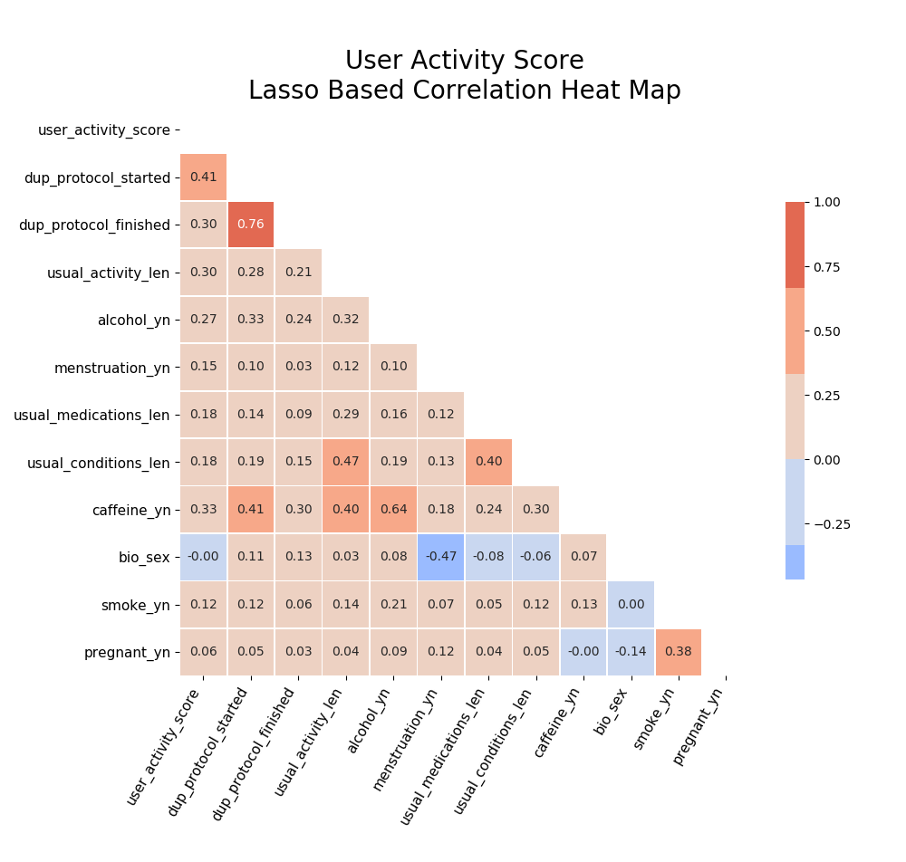
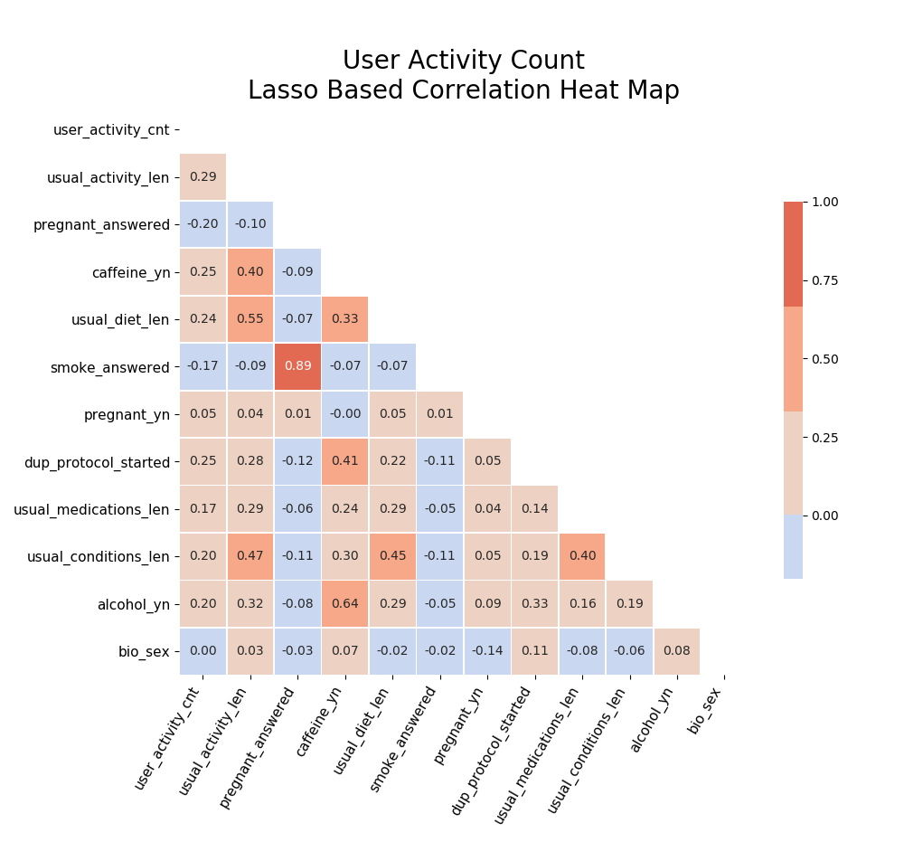
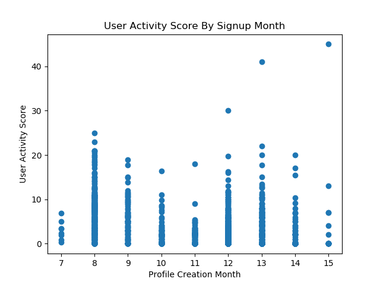
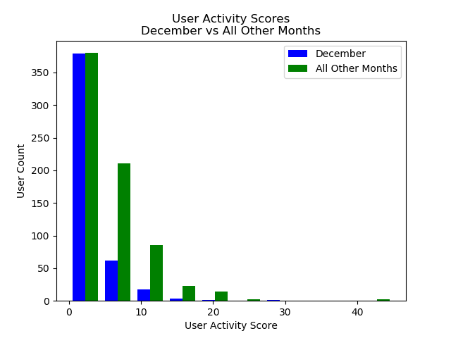
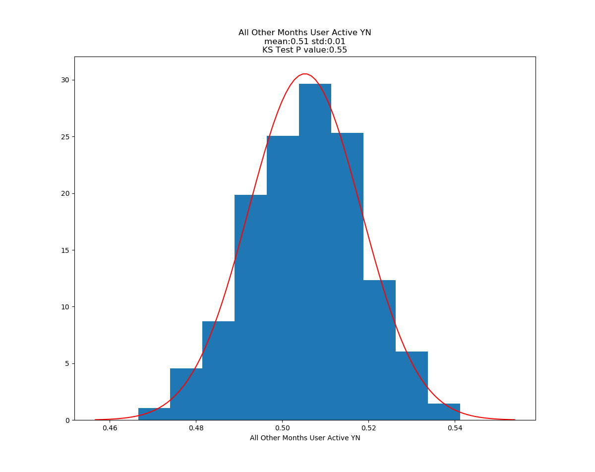
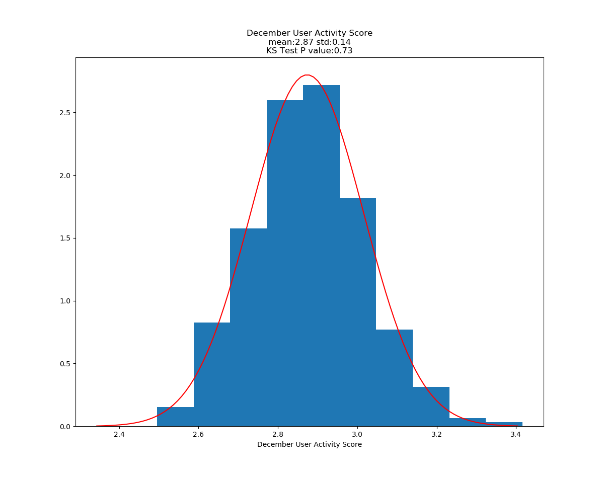
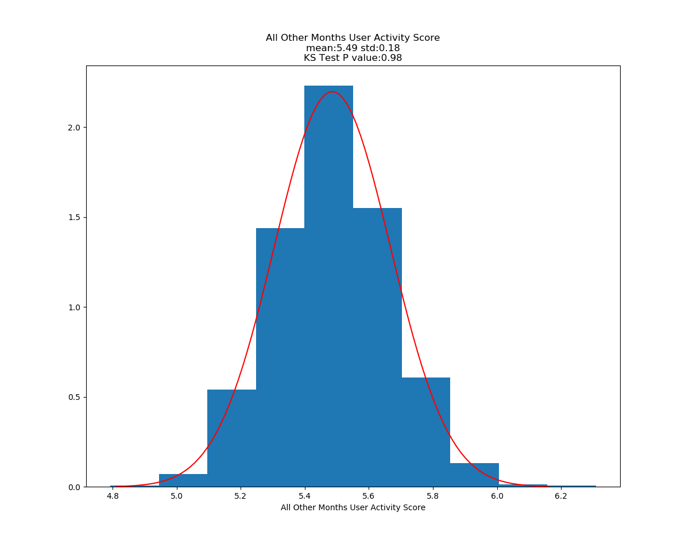
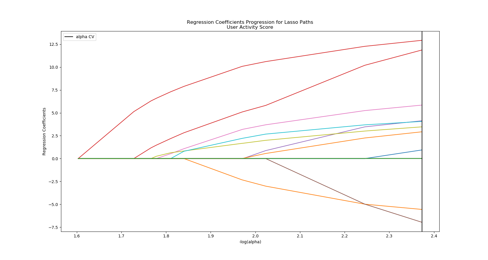
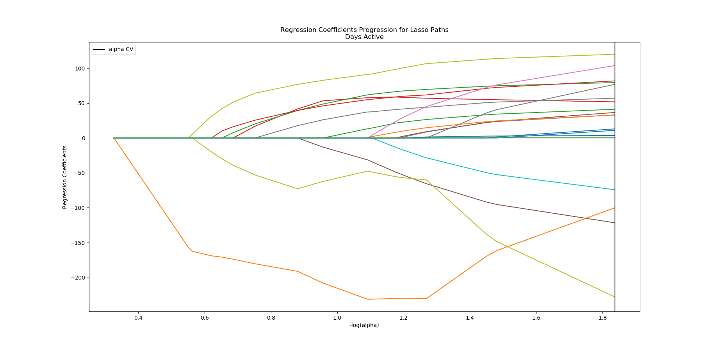
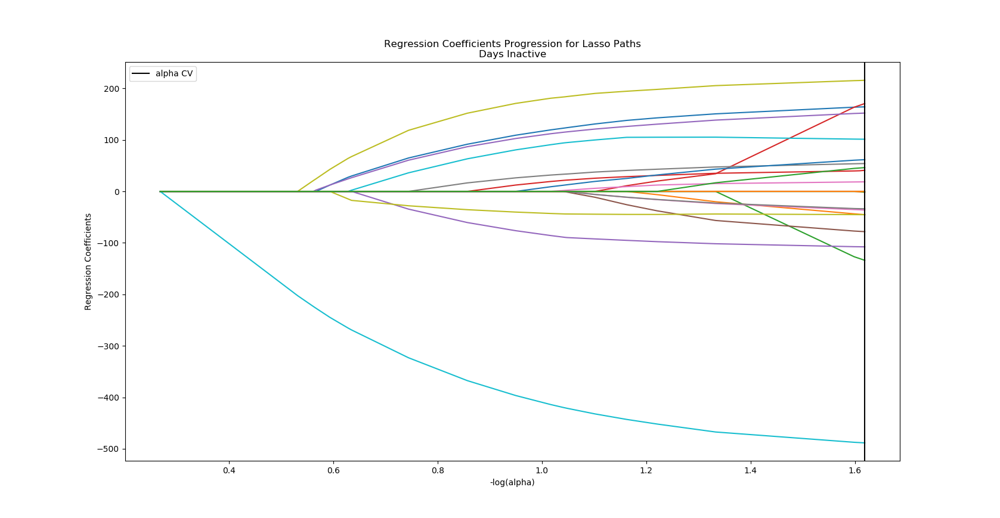

# Trackwell
## Data Science Capstone Project

My capstone is using data from the website Trackwell. This site was created to allow users to upload 'protocols' and 'hypothesis tests' for themselves and others to use with the hopes of croudsourcing data collection and allowing conclusions to be drawn on the 'protocols' or experiments being run. For now, Trackwell needs to know if it is possible to predict which users will provide the most data and/or when a user might stop using the service. Going forward, it will also be important to know how believable a given users entries are.

### Questions
The original questions that the owner of Trackwell asked me were:
- Can we develop a score for user participation so I can rank users and find those who are most involved?
- Can we predict whether a user will be more or less involved in the future?
- Can we develop a threshold below which a user isn't inputting enough data for us to do any analysis?

The questions I am answering in this section are:
- Is there a statistical difference in activity level, days active, and/or amount of data provided by users that signed up due to a large push from a fitness blogger?
- Can we develop a score for user participation so I can rank users and find those who are most involved?
  * I am using assigning an activity score per user based on the number of data points they have provided and the number of days they have been active on the service.
- Can we predict whether a user will be more or less involved in the future?
  * Ultimatly, the final answer for this question will probably be a time series model. For now, I will see what I can do with logistic and linear modeling.
  * I am starting with:
    - Can we predict if a user will be involved at all based on their profile data?
  * If I have time, I will also look at:
    - Can we predict which users will go inactive based on their profile data?
    - If they will be active, can we predict if they will complete a protocol?
    - If they will be involved, can we prodict how involved based on their profile data?
    - Based on past involvement or profile data, can we predict how long a user will remain active?
    - Based on past involvement or profile data, can we predict how long a user will go inactive?
    
### Exploratory Data Analysis and Data Cleaning/Creation 
There are no pre-defined site involvment levels, tracking of how long a user has been active/inactive or other metric tracking so those features will have to be created from existing data.
- __days_active:__ (last date a user entered data on the site) - (the day the user signed up on the site)
- __days_inactive:__ (day data was pulled) - (last date a user entered data on the site)
- __user_data_cnt:__ (number of unique, non-null data points associated with their profile data) + (number of followup entries)
- __user_activity_score:__ (user_data_cnt) / (days_active)
- __user_active_yn:__ yes if user activity score is above 0

There appears to have been a manual data load into the database at somepoint as there are some users with 0-1 Total days active but 2000 data points. In those cases, the first date with an entry assigned to it will take the place of theire sign up date. Profile data was also manipulated to determine if the data entered or the the fact that anything was entered was more important to predicting future activity. For features with a lot of nulls, I chose between assuming the median value for the field or dropping the feature on a per feature basis. I made the decision based on the likelihood of the median value being correct. For example, I dropped the raw blood type feature after determinning if it was answered or not because I have no way of knowing which blood type is correct but I assumed a null in married simply meant no because there weren't very many nulls for the feature and I assume a person is more likely to answer a question they feel pertains to them. I wanted to keep as many features early on as possible as I didn't know if bothering to answer the questions was actually more important than the final answer provided. For profile fields that were open text, I took a character count as the simplest way of summarizing the complexity of their input. Once I created a numeric represintative for the text fields, I dropped them from modeling.

- __usual_activity_len:__ the character count of the entry in the usual_activity field
- __dup_protocol_started:__ changed to a yes/no instead of actual protocol hashes
- __dup_protocol_finished:__ changed to a yes/no instead of actual protocol hashes
- __usual_medications_len:__ the character count of the entry in the usual_medications field
- __married_answered:__ changed to yes/no for if the queston was answered
- __menstruation_answered:__ changed to yes/no for if the queston was answered
- __bio_sex_answered:__ changed to yes/no for if the queston was answered
- __blood_type_answered:__ changed to yes/no for if the queston was answered
- __pregnant_answered:__ changed to yes/no for if the queston was answered
- __caffeine_answered:__ changed to yes/no for if the queston was answered
- __alcohol_answered:__ changed to yes/no for if the queston was answered
- __smoke_answered:__ changed to yes/no for if the queston was answered
- __usual_diet_len:__ the character count of the entry in the usual_diet field
- __usual_conditions_len:__ the character count of the entry in the usual_conditions field
- __dup_protocol_active:__ changed to a yes/no instead of actual protocol hashes
- __height_likelihood:__ the probability that the height reported exists in the adult population
  * This was determined with a very forgiving normal distribution based on the average of the mean heights for men and women and adding together the standard distribution for the two groups. It is not meant to predict if they were accurate but to simply show where heights provided were not feasible (40 cm for example).
  
I later came back and dropped both dup_protocol_finished and dup_protocol_active because they were systematically set regardless of user interaction after a protocol was started. 

Features that will probably be useful in the future but haven't been created yet:
- Change User Active YN to User Active Ever YN and User Currently Active YN
- Longest time between logins
- Current time since last login
- Months since signup
- Entries Other Than Profile YN
- Number of protocols signed up for
- Which protocol(s) signed up for
- How they found the site
- Which medications each person is on
- What pre-existing conditions they have 
- Number of protocols completed
- Likelihood of inputs for the entries (similar to likelihood of height) would need to be written on a per entry-type basis to determine if someone's data in a given protocol can be used towards completing that protocol's hypothesis test.
  
Because these features are based on existing features, there are likely to be highly correlated sets in the full feature map. I intend to pick only some of the features, avoiding correlated groups, for the final models. For most of my analysis, I was looking at 2933 unique users with about 30 features.

Correlation Heatmap:  

I later came back to check correlations specifically in the features suggested by my lasso regression models:

Correlations For User Active YN: 

Correlations For User Active Score: 

Correlations For User Active Count: 

Correlations For Days Active: 

Correlations For Days Inactive: 


After going back and fixing for the dataload, the timebased correlations became more obviouse:

Total Number of Days Active By Signup Month:  

Days Since Last Activity By Signup Month:  

And the thought that the blogger's push for January activity (people signing up in December to start in January) was helpful in increasinng the percentage of involvement becomes less likely, though it does seem to have pushed a higher volume of people to the site:

Activity Score By Signup Month:  

Signups By Month: 

## Hypothesis Test

  
  
  
__Question:__ Is there a statistical difference in activity level for users that signed up due to a large push from a fitness blogger when compared with everyone else?

>>>__H<sub>0</sub>:__ There is no difference in involvment metrics for Dec when compared to the rest of the year.

>>>__H<sub>1</sub>:__ There is a difference in involment metrics for Dec when compared to the rest of the year.

>>>__alpha:__ .025 = (.05/2)

I used a two population t-test for each metric to determine if there was a statistical differance. Due to the time sequence effect on Days Active and Days Inactive, I decided not to include them in the testinng as a difference between Dec and the rest of the year could simply be due to people signing up in Dec having less time to be active or inactive on the service.

__TTest Assumptions:__ 
  * Independent observations: Each record is a seperate and unique account. No account can have two creation months.
  * Homogeneity: The standard deviations are very close for the YN populations but are different for the Score populations. 
  * Normality: bootstrapped sample means for each population in each test. Because of this, I limited the Score populations to only users who were active (removing all the zeros that are covered in the YN question). 
  
    
  
  __Activity Scores Before Removing Inactive Users:__
    
  
  __Activity Scores After Removing Inactive Users:__
     
   
Running ttest on User Activity Scores for Dec vs all other months

>>>Dec Average: 5.488265227289548
>>>Year Average: 5.488265227289548
>>>Ttest_indResult(statistic=0.0, pvalue=1.0)


Running ttest on Users Active YN for Dec vs all other months

>>>Dec Average: 0.30687830687830686

>>>Year Average without Dec: 0.5045742434904996

>>>Ttest_indResult(statistic=-11.124419257482321, pvalue=3.613288170575678e-28)

__Conclusion:__ In metrics that have been normalized for total time on the system, there does appear to be a statisticaly significant difference in users who signed up in December and all other users as far as initial decisions to use or not use the site go. Unfortunantly for Trackwell, this segment of their users appear to be less likely to be active at all on the site; if they do use the site, they seem to provide the same amount of data as users who come to it through other routes.

### Logistic and Linear Regression
#### Lasso to Pick Features

User Active YN Coefficients: 
```python
coefficients             predictors      sort
3       0.199714   dup_protocol_started  0.199714
8       0.037674            caffeine_yn  0.037674
5       0.031455  dup_protocol_finished  0.031455
7       0.029471             married_yn  0.029471
13      0.027493     usual_activity_len  0.027493
6       0.019620             alcohol_yn  0.019620
20      0.016918       bio_sex_answered  0.016918
9       0.011760        menstruation_yn  0.011760
19      0.008540    blood_type_answered  0.008540
12      0.008184         usual_diet_len  0.008184
11      0.006984  usual_medications_len  0.006984
10      0.003065   usual_conditions_len  0.003065
16      0.000000       married_answered  0.000000
21      0.000000  menstruation_answered  0.000000
18      0.000000      pregnant_answered  0.000000
17      0.000000      caffeine_answered  0.000000
0       0.000000            pregnant_yn  0.000000
15      0.000000       alcohol_answered  0.000000
14      0.000000         smoke_answered  0.000000
1       0.000000                bio_sex  0.000000
4       0.000000               smoke_yn  0.000000
2       0.000000    dup_protocol_active  0.000000
22      0.000000      height_likelihood  0.000000
```
User Activity Score Coefficients: 
```python
    coefficients             predictors      sort
3       0.434011   dup_protocol_started  0.434011
13      0.421182     usual_activity_len  0.421182
5      -0.245248  dup_protocol_finished  0.245248
6       0.203033             alcohol_yn  0.203033
1      -0.191818                bio_sex  0.191818
4       0.146544               smoke_yn  0.146544
9       0.140283        menstruation_yn  0.140283
8       0.121382            caffeine_yn  0.121382
11      0.103242  usual_medications_len  0.103242
0       0.032777            pregnant_yn  0.032777
10      0.000000   usual_conditions_len  0.000000
7       0.000000             married_yn  0.000000
12      0.000000         usual_diet_len  0.000000
2       0.000000    dup_protocol_active  0.000000
14      0.000000         smoke_answered  0.000000
15      0.000000       alcohol_answered  0.000000
16      0.000000       married_answered  0.000000
17      0.000000      caffeine_answered  0.000000
18      0.000000      pregnant_answered  0.000000
19      0.000000    blood_type_answered  0.000000
20      0.000000       bio_sex_answered  0.000000
21      0.000000  menstruation_answered  0.000000
22      0.000000      height_likelihood  0.000000
```
User Activity Count Coefficients: 
```python
    coefficients             predictors       sort
13     35.409223     usual_activity_len  35.409223
18    -17.519923      pregnant_answered  17.519923
8      17.065931            caffeine_yn  17.065931
12     13.678984         usual_diet_len  13.678984
14    -11.344958         smoke_answered  11.344958
0       8.460380            pregnant_yn   8.460380
3       6.816043   dup_protocol_started   6.816043
11      5.861865  usual_medications_len   5.861865
10      5.292121   usual_conditions_len   5.292121
6       2.476444             alcohol_yn   2.476444
7       0.000000             married_yn   0.000000
9       0.000000        menstruation_yn   0.000000
1       0.000000                bio_sex   0.000000
5       0.000000  dup_protocol_finished   0.000000
4       0.000000               smoke_yn   0.000000
15      0.000000       alcohol_answered   0.000000
16      0.000000       married_answered   0.000000
17      0.000000      caffeine_answered   0.000000
2       0.000000    dup_protocol_active   0.000000
19      0.000000    blood_type_answered   0.000000
20      0.000000       bio_sex_answered   0.000000
21      0.000000  menstruation_answered   0.000000
22      0.000000      height_likelihood   0.000000
```
User Days Actiive Coefficients: 
```python
    coefficients             predictors      sort
18     -7.939721      pregnant_answered  7.939721
8       4.175520            caffeine_yn  4.175520
15     -4.164881       alcohol_answered  4.164881
16      3.820201       married_answered  3.820201
21     -3.396733  menstruation_answered  3.396733
12      3.377943         usual_diet_len  3.377943
17      2.885086      caffeine_answered  2.885086
13      2.756762     usual_activity_len  2.756762
19     -2.514606    blood_type_answered  2.514606
7       1.986782             married_yn  1.986782
3       1.754221   dup_protocol_started  1.754221
2       1.399556    dup_protocol_active  1.399556
5       1.265259  dup_protocol_finished  1.265259
11      1.262112  usual_medications_len  1.262112
4       1.176299               smoke_yn  1.176299
0       0.432050            pregnant_yn  0.432050
20      0.397348       bio_sex_answered  0.397348
10      0.128824   usual_conditions_len  0.128824
14      0.000000         smoke_answered  0.000000
1       0.000000                bio_sex  0.000000
9       0.000000        menstruation_yn  0.000000
6       0.000000             alcohol_yn  0.000000
22      0.000000      height_likelihood  0.000000
```
User Days Inactive Coefficients: 
```python
    coefficients             predictors       sort
22     16.926637      height_likelihood  16.926637
19    -16.544399    blood_type_answered  16.544399
8       7.583835            caffeine_yn   7.583835
3       6.295368   dup_protocol_started   6.295368
0       5.470116            pregnant_yn   5.470116
4       5.255658               smoke_yn   5.255658
2      -4.857834    dup_protocol_active   4.857834
14     -3.655486         smoke_answered   3.655486
9       3.530928        menstruation_yn   3.530928
5      -2.756194  dup_protocol_finished   2.756194
20      2.196281       bio_sex_answered   2.196281
7       1.882430             married_yn   1.882430
1      -1.565740                bio_sex   1.565740
13      1.498393     usual_activity_len   1.498393
18     -1.481262      pregnant_answered   1.481262
16     -1.330033       married_answered   1.330033
17     -1.097371      caffeine_answered   1.097371
6       0.645090             alcohol_yn   0.645090
11     -0.050747  usual_medications_len   0.050747
12     -0.039863         usual_diet_len   0.039863
10      0.000000   usual_conditions_len   0.000000
15      0.000000       alcohol_answered   0.000000
21      0.000000  menstruation_answered   0.000000
```
### Logistic Regression on User Active YN
I started by feeding the predictors selected by Lasso directly in a Logistic model and seeing how it did:
```python
                Optimization terminated successfully.
                 Current function value: 0.526785
                 Iterations 6
                                   Logit Regression Results
        ==============================================================================
        Dep. Variable:         user_active_yn   No. Observations:                 2933
        Model:                          Logit   Df Residuals:                     2921
        Method:                           MLE   Df Model:                           11
        Date:                Wed, 14 Mar 2018   Pseudo R-squ.:                  0.2185
        Time:                        16:15:48   Log-Likelihood:                -1545.1
        converged:                       True   LL-Null:                       -1977.1
                                                LLR p-value:                3.387e-178
        =========================================================================================
                                    coef    std err          z      P>|z|      [0.025      0.975]
        -----------------------------------------------------------------------------------------
        dup_protocol_started      2.0052      0.109     18.390      0.000       1.792       2.219
        caffeine_yn               0.5336      0.140      3.799      0.000       0.258       0.809
        married_yn                0.3289      0.130      2.537      0.011       0.075       0.583
        usual_activity_len        0.0076      0.002      3.052      0.002       0.003       0.012
        alcohol_yn                0.1439      0.140      1.031      0.303      -0.130       0.417
        bio_sex_answered         -2.1063      0.165    -12.738      0.000      -2.430      -1.782
        bio_sex                  -0.0544      0.151     -0.360      0.719      -0.351       0.242
        menstruation_yn           0.3793      0.198      1.915      0.055      -0.009       0.767
        blood_type_answered       0.4903      0.201      2.434      0.015       0.096       0.885
        usual_diet_len            0.0036      0.002      1.918      0.055   -7.82e-05       0.007
        usual_medications_len     0.0105      0.005      2.104      0.035       0.001       0.020
        usual_conditions_len     -0.0006      0.002     -0.241      0.809      -0.005       0.004
        =========================================================================================

        Accuracy of logistic regression classifier on test set: 0.7761363636363636

        10-fold cross validation average accuracy: 0.7973431210040255
        10-fold cross validation average recall: 0.8910320505409649
        10-fold cross validation average precision: 0.6895829278788901

                     precision    recall  f1-score   support
                  0       0.89      0.70      0.79       520
                  1       0.67      0.88      0.76       360
        avg / total       0.80      0.78      0.78       880
```


I then standardized each feature and dropped the least significant ones again:
```pthon
        Optimization terminated successfully.
             Current function value: 0.526996
             Iterations 6
                               Logit Regression Results
    ==============================================================================
    Dep. Variable:         user_active_yn   No. Observations:                 2933
    Model:                          Logit   Df Residuals:                     2924
    Method:                           MLE   Df Model:                            8
    Date:                Wed, 14 Mar 2018   Pseudo R-squ.:                  0.2182
    Time:                        16:28:52   Log-Likelihood:                -1545.7
    converged:                       True   LL-Null:                       -1977.1
                                            LLR p-value:                6.059e-181
    =========================================================================================
                                coef    std err          z      P>|z|      [0.025      0.975]
    -----------------------------------------------------------------------------------------
    dup_protocol_started      2.0102      0.109     18.451      0.000       1.797       2.224
    caffeine_yn               0.5956      0.125      4.768      0.000       0.351       0.840
    married_yn                0.3423      0.129      2.654      0.008       0.090       0.595
    usual_activity_len        0.0077      0.002      3.134      0.002       0.003       0.012
    bio_sex_answered         -2.1518      0.099    -21.661      0.000      -2.347      -1.957
    menstruation_yn           0.4179      0.153      2.740      0.006       0.119       0.717
    blood_type_answered       0.4939      0.201      2.456      0.014       0.100       0.888
    usual_diet_len            0.0036      0.002      1.983      0.047    4.08e-05       0.007
    usual_medications_len     0.0106      0.005      2.153      0.031       0.001       0.020
    =========================================================================================

    Accuracy of logistic regression classifier on test set: 0.7784090909090909

    10-fold cross validation average accuracy: 0.7992967085010656
    10-fold cross validation average recall: 0.9086556035571437
    10-fold cross validation average precision: 0.6866515937577335

                 precision    recall  f1-score   support
              0       0.92      0.69      0.79       520
              1       0.67      0.91      0.77       360
    avg / total       0.82      0.78      0.78       880
```

